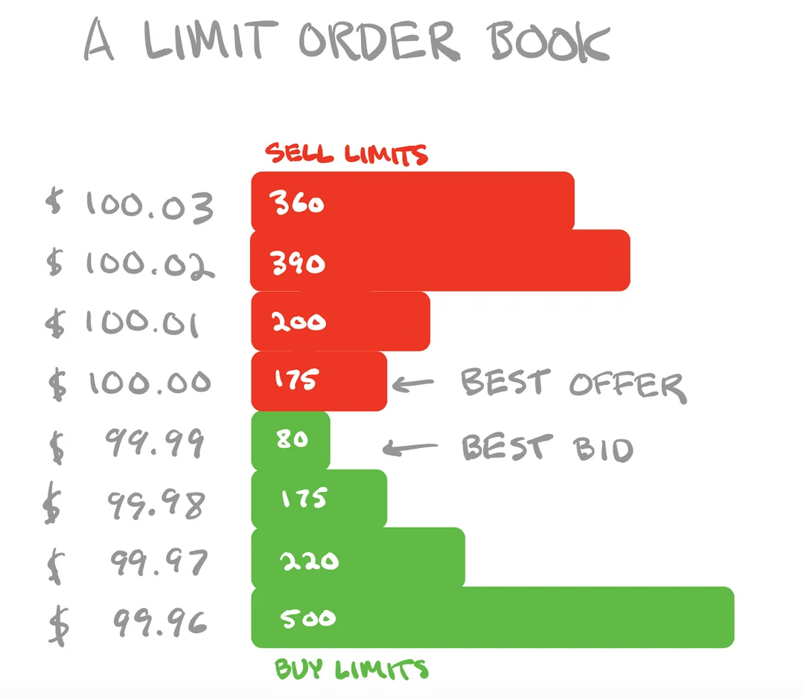
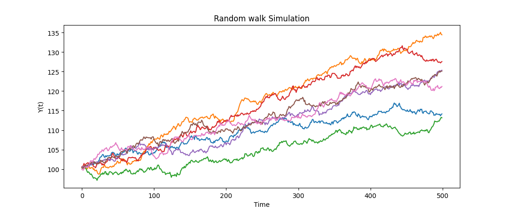

<!-- _paginate : Hide -->
<!-- Add this anywhere in your Markdown file -->

## Financial markets, Algorithmic Trading & Statistical Arbitrage

Amol Gupta

PHM 953 Self Study

---
## Type of orders

- market
- limit
- Stop market
- Stop limit
<!-- 
Market order means get me the quantity at the prevailing market price. Fills are faster there is impact cost. You end up walking the order book.
Limit order means that you decide the price. You may have to wait for the fill.
Stop order are accepted at trigger price worse than prevailing prices
-->

---
## Limit order book

- market maker
- bid and ask
- walking the book
<!-- 
Market makers place resting limit orders. Typically market orders are matched against limit order

best bid is the highest price at which someone is willing to buy. Your market sell order will match with best bid

Best ask is the minimum price at which someone is willing to sell. Your market buy order will match best ask.

best bid is less than best ask

If your orders are big you end up walking the book
-->

---

## Limit order book
 

<!-- _footer : "[source:Reddit](https://www.reddit.com/r/algotrading/comments/pll069/limit_order_book_or_ledger/)" -->

---
## Long & Short
<!--
Going long is placing a bet that Price of an asset will go up.
You buy before you sell.
Hindenberg Adani
Placing a bet that some asset price will go down 
Some countries allow longer shorting and some don't
Intraday equity shorting is possible as settlement happens at the end of day
You can borrow and short
Derivative can be used to short
-->

---

# Different types of random process
normal distribution
random walk
OU process
<!--
vecm
-->
---

Gaussian Noise

 

---
Ornstein-Uhlenbeck Process

$$
X_{t+\Delta t} = X_t + \theta (\mu - X_t) \Delta t + \sigma \epsilon_t
$$
 

---

Gaussian Random walk
$$
y(t) = y(t - \Delta t) + X(t)
$$

 

---
# Return

returns
$$
r =  \frac{p(t)}{p(t-1)} -1
$$

---

# Risk & Beta

Risk is std dev of returns aka uncertainity

 

---
# Type of strategies used in market
Some investors like low correlation to market/beta/index, want to avoid large drawdown. 

- Momentum
- Mean Reversion
- Statstical Arbitrage
- Long Short equity
- Market making
- Factor based investing
  - Growth
  - Value
  - Momentum

---
### Statstical Atbitrage

- Stationarity
- Order of integration
- Cointigration

---

### Statstical Atbitrage

- Cluster equities
- Build portfolio
- Decide entry and exit points

---

### Statstical Atbitrage

 

---

# Thank you
