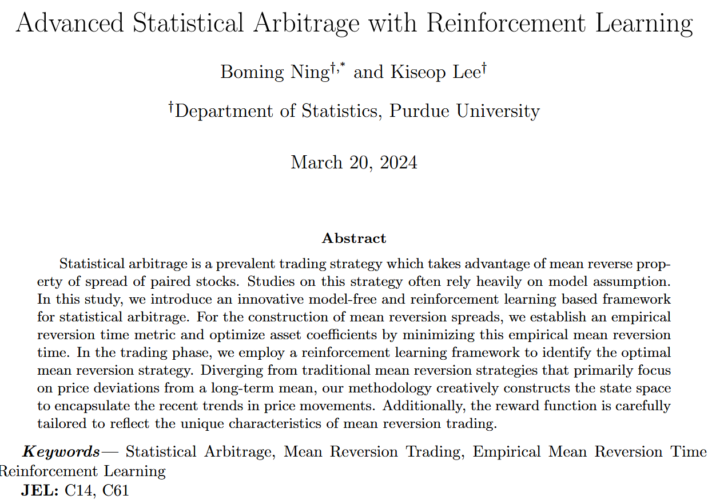
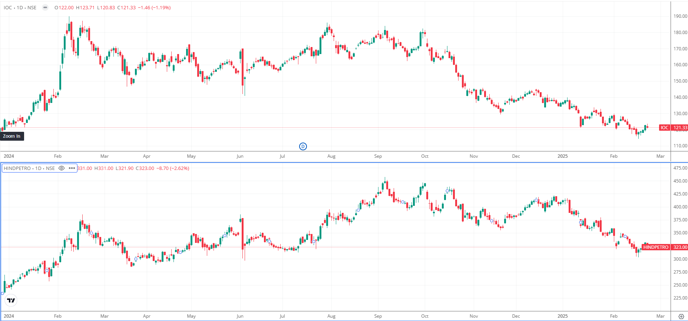
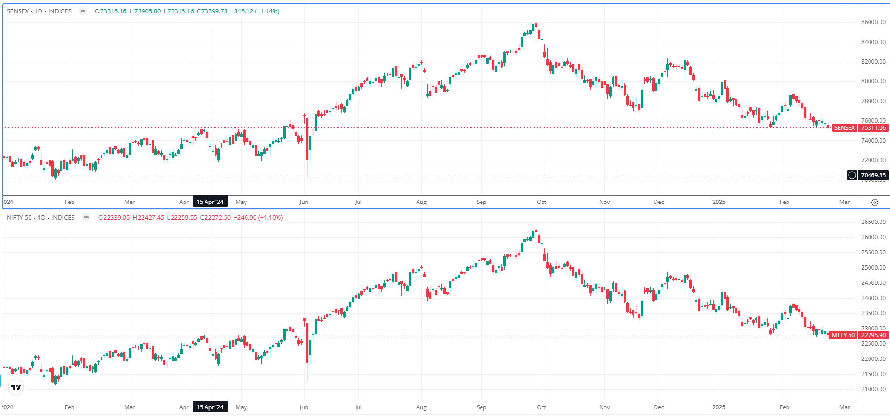
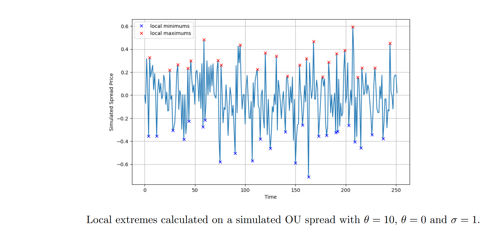
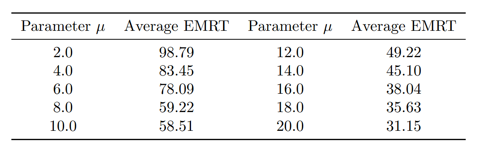
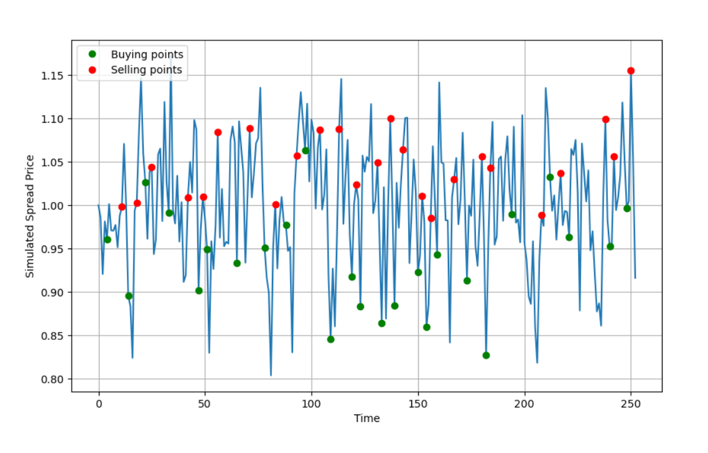
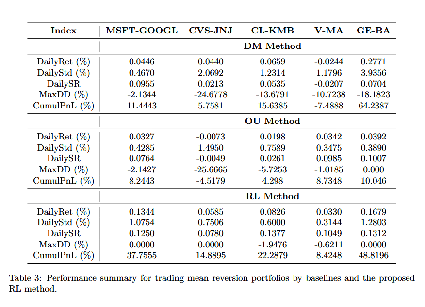
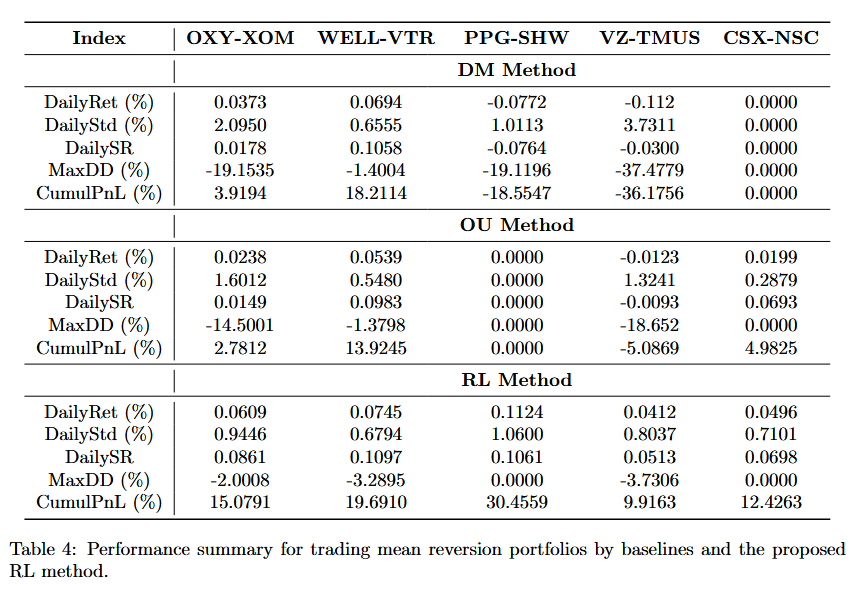

<!-- _paginate : Hide -->
<!-- Add this anywhere in your Markdown file -->

## Financial markets, Algorithmic Trading & Statistical Arbitrage (part 2)

Amol Gupta

PHM 953 Self Study

---

 

---

# Statistical arbitrage

- Identify assets that co-move/cointegrated
- Make mean reverting portfolios
- Decide entry and exit condition

---

 

---

 

---
# Empirical Mean Reversion Time

Given $n$ similar stocks $S_i, n=1,2,\ldots,n$ we form a spread $X= \sum_{i=1}^{i=n} a_i S_i$. Our goal is to find a portfolio $(a_1.a_2,\ldots,a_n)$ such that the spread has a mean reverting property as much as possible.

$$ dX_t = \mu (\theta - X_t)dt + \sigma dW_t$$

---

# Empirical Mean Reversion Time (contd. 2)

we define the stopping time as 

$$\tau_t = inf\{s>t : X_s = \theta | X_t = \theta - a\} $$

---

# Empirical Mean Reversion Time (contd.)

- The time series $X_t$ where $T \in [0,T]$ is discrete $(X_1,\ldots, X_n)$
- $X_m$ is a important minimum(max); indicies $i,j$ where  $i \leq m \leq j$ where
  - $X_m$ is minimum(max) among $X_i\ldots X_j$
  - $X_i - X_m \geq C.s$ and $X_j-X_m \geq C.s$

---
# Empirical Mean Reversion Time (contd.)

- $\tau_1 = inf\{u \in [0,T]:X_u \text{is local extreme} \}$
- $\tau_2 = inf\{u \in [\tau_1,T]: X_u= \hat{\theta}\}$
- $\tau_{n \in {\text{odd numbers}}} = inf\{u \in [0,T]:X_u \text{is local extreme} \}$
- $\tau_{n \in {\text{odd numbers}}} = inf\{u \in [\tau_1,T]: X_u= \hat{\theta}\}$
---

# Empirical Mean Reversion Time (contd.)

$$ r = \frac{2}{N} \sum_{n=2, i \in even }^{N}  (\tau_{n} - \tau_{n-1})$$

---

# RL model for mean reversion trading
- Price of the stock at time instant $i$ is $P_i$
- Precent change in stock price a.k.a. price returns
  $$ \text{let } \pi_i = \frac{P_i-P_{i-1}}{P_{i-1}}$$

---
# RL model for mean reversion trading
- let the state be represented by change vector 
    $$ S_t = [d_{t-l+1}, d_{t-l+2}, \ldots,d_{t}] $$
    where
     $$
        d_i= 
        \begin{cases}
            +2  \text{ if }\pi_i \gt k\\
            +1  \text{ if } 0 \lt \pi_i \lt k\\
            -1  \text{ if }\\ -k \lt \pi_i \lt 0
            -2  \text{ if }\\ \pi_i \lt 0
        \end{cases}
     $$

---

# RL model for mean reversion trading (contd.)

Action space
  $$A_t \in \{ -1, 0,1\}$$

Reward function
  $$ R_{t+1} = A_{t} . (\theta -X_{t}) - C. |A_{t}| $$

Goal function 
  $$ G_{t} = \sum _{s=t+1}^{T} e^{-r(s-t)} .R_{s} + I_{T} .X_{T} $$

---

# Experiments

---

# Experiments with EMRT

---

# Experiments with EMRT (contd.)

---

# RL trading with simulated data

---

# Real World Experiments

---

# Real World Experiments

---

# Thank you