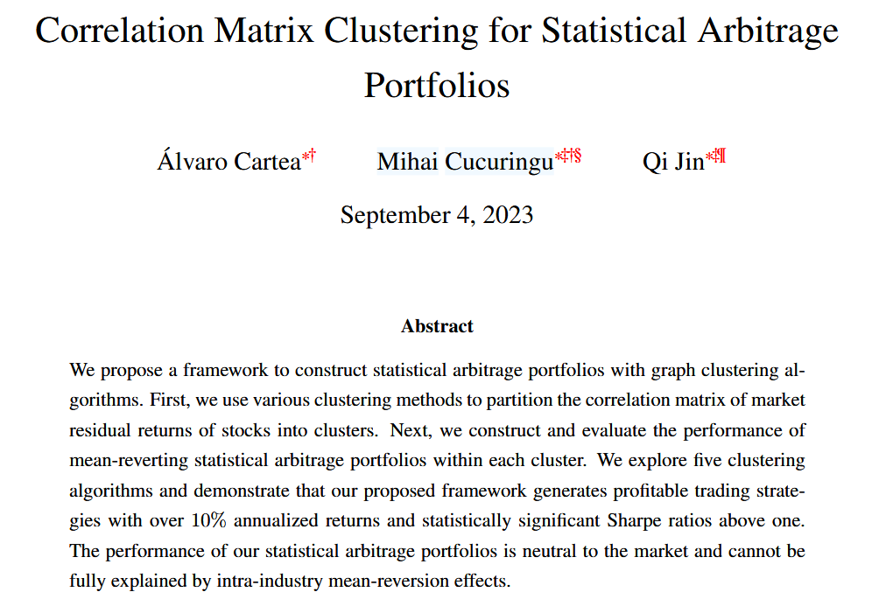
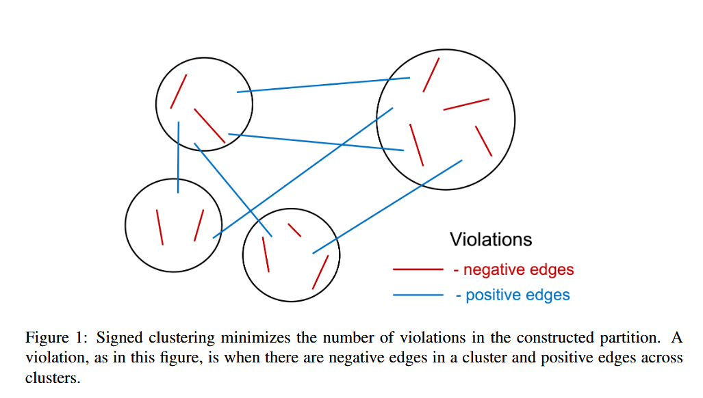
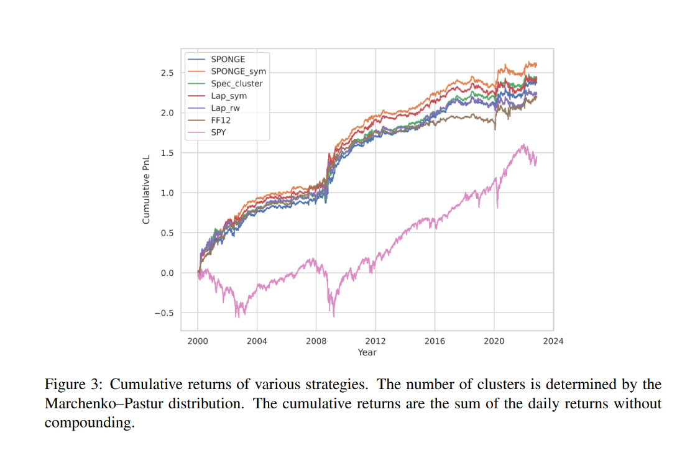
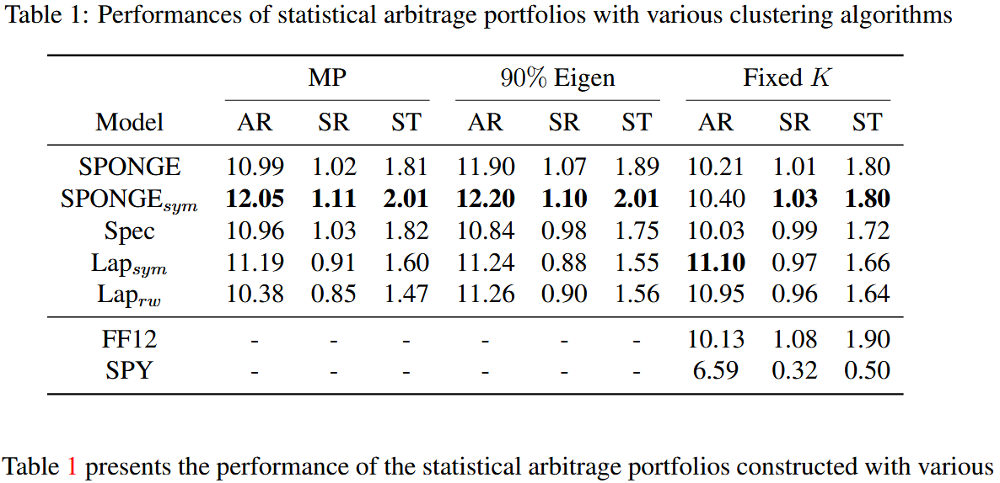

<!-- _paginate : Hide -->
<!-- Add this anywhere in your Markdown file -->

## Financial markets, Algorithmic Trading & Statistical Arbitrage (part 3)

Amol Gupta

PHM 953 Self Study

---

 

---
# Contributions
- Framework for contructing statistical arbitrage portfolios using graph theory
- Uses spectral graph clustering
- Construct mean reverting portfolios

---
#  Mathematical Model and Problem Setting
- Stock returns -> residual returns
- Time series -> correlation matrix -> adjacency matrix
  

---
# Clustering method

- Spectral clustering
- Signed laplacian clustering
- Sponge
  
---
# Portfolio construction

- Data preporocessing 
- Group stocks into disjoint clusters
- Identify collection of stock within the cluster that can form mean reverting portfolio
- Assign portfolio weights to the selected stocks
---
# Data Preprocessing

- Market residual return $R^{res}_{i,t}$ of stock $i$ at time $t$
   $$ R^{res}_{i,t} = R^{res}_{i,t} - \beta_i R_{mkt,t}  $$
<!-- SPY etf as market proxy, We use 60 trading day rolling window and perhaps daily time frame -->

- Correlation matrix $C$
$$c_{i,j} = \frac{\sum_{t= T-\omega }^{T-1} (R^{res}_{t,i} - \bar{R^{res}_{i}}) (R^{res}_{t,i} - \bar{R^{res}_{j}} )  }{ (\omega -1) \sigma_i \sigma_j} $$
---
<!-- 
# clustering

- Create K clusters

--- -->

# Identify stocks to trade
Consider the returns of stocks $R_{1,t}, \ldots  R_{j_n,t}$ in cluster $j$, define the cluster mean return at time  $T$ over the lookback period of $w$ days as

$$
   \bar{R}_{j,t}  = \frac{1}{j_n} \sum\limits_{i=1}^{j_n} R_{i,t}
$$

---
# Identify stocks to trade (cont.)
We identify stock $j_i$ with return $R_{j_i,t}$ in cluster $j$ where deviation 
$$\sum\limits_{t=T-\omega}^{T-1} (R_{j_i,t}- \bar{R}_{j,t} ) > p$$
 as previous winners

We identify stock $j_i$ with return $R_{j_i,t}$ in cluster $j$ where deviation 
$$\sum\limits_{t=T-\omega}^{T-1} (R_{j_i,t}- \bar{R}_{j,t} ) < p$$
 as previous losers

---
# Assign weights to stocks
- Short the winner
- Long the loser
- Equal weighted
- Dollar neutral
- Hold for $l$ days
- Stop win or take profit and rebalance
  
---
# Benchmark

- SPY ETF
- Fama-French 12 industry classification

---
# Evaluation

- Annulaized return
- Sharpe ratio
- Sortino ratio
---

# Empirical Results
## Data
  - WRDS
  - 2000 to 2022
  - Universe of 600 stocks

---
# Empirical Results
## Parameters
  - 20 day lookback to estimate cluster
  - 60 day lookback to estimate $\beta$ 
  - 5 day look back period $\omega$ for correlation matrix $C$
  - threshold $p = 0$
  - Rebalance period $l=3$
  - stop win threshold $q=5%$

---

---

---

# Thank you
